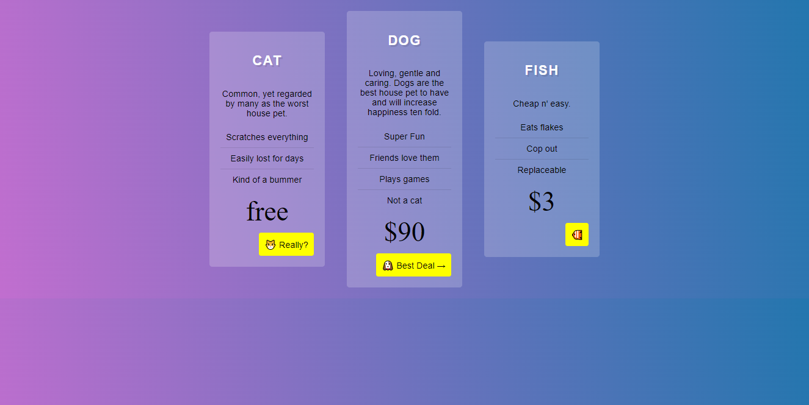

# Grid

This is my solution to the [CSS Grid](https://https://cssgrid.io/). This tutorial helped me learn Grid the right way, and it also changed how I align multiple items.

## Table of contents

  - [Table of contents](#table-of-contents)
  - [Overview](#overview)
    - [Some information](#some-information)
    - [Examples on what I made](#examples-on-what-I-made)
    - [Link](#link)
  - [My process](#my-process)
    - [What I learned](#what-i-learned)
    - [Continued development](#continued-development)
    - [Useful resources](#useful-resources)
  - [Author](#author)
  - [Acknowledgments and source](#acknowledgments-and-source)
 

## Overview

### Examples on what I made
Responsive website layout:

Image Gallery:
### Examples on what I made
Mobile app layout:

 

 

 

### Link

- Live Site URL: [My live site](https://purplehippo911.github.io/grid/)

### What I learned
I learned how to align multiple items using CSS Grid. 

### Continued development
I am planning on making my own little website. I will also try to get more comfortable with grid and try to recap on my JS with challenges from [frontend mentor](https://frontendmentor.io) 

### Useful resources

- [CSS tricks](https://css-tricks.com/snippets/css/complete-guide-grid/) - This is an extra resource which has a downloadable cheatsheet for grid, which is good for recap.  
 
## Author

- Frontend Mentor - [@purplehippo911](https://www.frontendmentor.io/profile/purplehippo911)
- Github - [@purplehippo911](https://www.github.com/purplehippo911)

## Acknowledgments and source

Huge thanks to [Wes Bos](https://wesbos.com) for creating  this free tutorial. And thanks to you for checking out my repository. 

And HAPPY CODING!🎆🍙🍕🧨🧶🧶🛒👓 
                                                                
